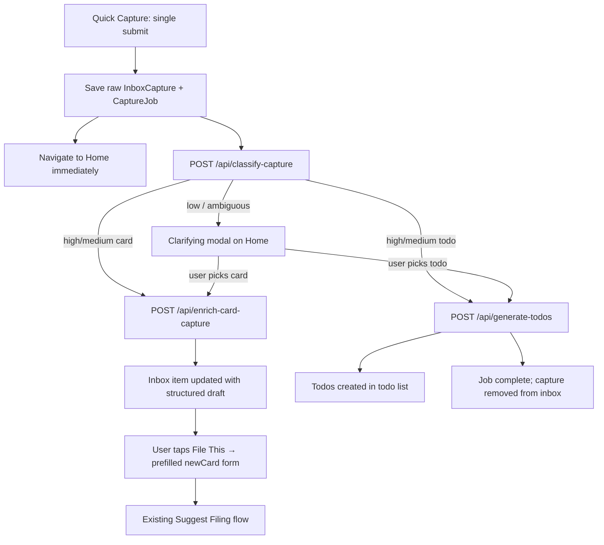

# Second Mind Capture Routing Contract

This document defines the canonical contract for **unified AI capture routing** in Second Mind (Phase A).

The goal is to make Quick Capture a true catch-all: one rough submission, immediate return to Home, and background AI that routes the capture to either **card enrichment** or **todo generation** — without blocking the user on a thinking screen.

This contract sits alongside:
- `docs/second-mind-ai-rewrite-contract.md` — structuring vs filing boundaries
- `docs/second-mind-filing-policy.md` — where cards belong after structuring

## Non-Negotiables

1. **Single submit** — Quick Capture has one save action. The user does not pick Card vs Todo before saving.
2. **Home immediately** — Save returns to Home right away. AI work runs in the background.
3. **Narrow AI calls** — Classify, enrich-card, and generate-todos are separate endpoints with separate responsibilities.
4. **AI recommends; app validates** — The app owns IDs, persistence, address generation, and save rules.
5. **Graceful degradation** — Timeouts and low confidence must produce usable local fallbacks, not dead captures.
6. **Filing unchanged** — Card routing stops at a structured inbox draft. Filing still uses the existing filing pipeline (`Suggest Filing` + deterministic mechanics).

## What Changes From Today

| Today | Phase A |
|-------|---------|
| Quick Capture: manual Card / Todo picker | Single submit; classifier decides route |
| Todo mode: sync local parse → todos, skips inbox | Todo route: async AI generation → todos |
| Card mode: raw inbox item only | Card route: async enrichment → prefilled inbox draft |
| Inbox "File With AI" runs structuring on demand | Normal card path is pre-enriched; File With AI is fallback only |
| No background jobs | `CaptureJob` tracks classify → enrich/generate lifecycle |
| Thinking screen blocks inbox AI filing | Thinking screen reserved for rare clarifications and manual retries |

## End-to-End Flow



## Capture Job Lifecycle

Every Quick Capture submission creates one **`CaptureJob`** tied to one **`InboxCapture`**.

### Job statuses

| Status | Meaning |
|--------|---------|
| `pending` | Raw capture saved; classify not started |
| `classifying` | Classify request in flight |
| `awaiting_clarification` | Classifier uncertain; user must choose card or todo |
| `enriching` | Card route: enrich-card request in flight |
| `generating_todos` | Todo route: generate-todos request in flight |
| `completed` | Terminal success |
| `failed` | Terminal error; capture still in inbox with fallback state |

### Job rules

1. Jobs are **client-owned** — stored in app state and persisted (see A2 implementation).
2. Only one active pipeline per capture ID at a time.
3. Completing a job does not auto-file cards. It only prepares data or creates todos.
4. On todo-route success, the inbox capture is **removed** after todos are saved.
5. On card-route success, the inbox capture **remains** with `intendedType: 'card'` and enrichment attached.
6. Failed jobs leave the raw capture in inbox; user can retry via manual inbox actions.

### Home processing indicator (A5)

While any job is in `pending`, `classifying`, `enriching`, or `generating_todos`:
- Home shows a compact processing indicator (count + short label, e.g. "Processing 2 captures").
- Tapping opens a lightweight list of active jobs with capture preview and status.
- No blocking modal unless clarification is required.

---

## Stage 0: Classify

**Endpoint:** `POST /api/classify-capture`

**Purpose:** Decide whether the rough capture is primarily a **card note** or a **todo list**, and how confident that decision is.

**Must not:** structure fields, pick categories, generate addresses, or create todos.

### Request

```json
{
  "capture": {
    "id": "string",
    "title": "string",
    "content": "string",
    "sourceText": "string (optional)",
    "createdAt": "ISO-8601"
  },
  "hints": {
    "userOverride": "card | todo | null",
    "localSignals": {
      "bulletLineCount": 0,
      "numberedLineCount": 0,
      "hasSourceCues": false,
      "looksLikeQuote": false
    }
  }
}
```

`hints.userOverride` is set only after a clarifying modal choice (A8). Otherwise `null`.

`localSignals` are cheap client heuristics from `utils/todoParsing.ts` and `utils/aiCataloguing.ts` — not authoritative, but useful context for the model.

### Response

```json
{
  "result": {
    "route": "card | todo",
    "confidence": 0.0,
    "confidenceBand": "high | medium | low",
    "reasoning": "short string",
    "alternatives": [
      { "route": "card | todo", "confidence": 0.0, "reasoning": "short string" }
    ],
    "needsClarification": false,
    "clarificationPrompt": "string (optional)"
  }
}
```

### Classification signals

**Strong card signals:**
- Quoted or paraphrased prose tied to a source
- Conceptual claim, aphorism, or idea seed without actionable checklist structure
- Source cues (author, URL, page, scripture reference)

**Strong todo signals:**
- Multiple bullet or numbered action lines
- Imperative task language ("buy", "call", "finish", "schedule")
- Explicit list framing ("todo", "tasks", "errands", "before Friday")

**Ambiguous (clarification candidates):**
- Single short line that could be either a card title or a one-item todo
- Mixed content: a paragraph plus a few bullets without clear dominance
- Empty title with one bullet line

### Confidence behavior

| Band | Behavior |
|------|----------|
| `high` | Proceed immediately on `route` |
| `medium` | Proceed on `route`; store `alternatives` for optional UI hint |
| `low` | Set `needsClarification: true`; job → `awaiting_clarification`; show modal on Home |

When `needsClarification` is true, the client must not call enrich or generate until the user chooses (or dismisses to leave raw capture in inbox).

### Local fallback (classify timeout / server error)

1. If `localSignals` show ≥2 bullet/numbered lines → route `todo`, band `low`.
2. Else if `localSignals.hasSourceCues` or `looksLikeQuote` → route `card`, band `low`.
3. Else → `needsClarification: true` with prompt "Is this a note for your library or a task list?"

---

## Stage 1a: Enrich Card Capture

**Endpoint:** `POST /api/enrich-card-capture`

**Purpose:** Turn a rough capture into a **structured card draft** ready for manual filing.

This replaces `/api/structure-capture` on the **normal Quick Capture card path**. It has the same output shape as `CaptureStructuringResult` so existing merge utilities (`utils/aiCaptureStructuring.ts`, `utils/aiCataloguing.ts`) can be reused.

**Must not:** choose category, invent card address, or save anything.

### Request

```json
{
  "capture": { "...": "InboxCapture fields" },
  "localDraft": {
    "suggestedTitle": "string",
    "suggestedContent": "string",
    "suggestedSource": { "type": "Other", "title": "", "...": "" },
    "strategy": "local"
  }
}
```

`localDraft` is always produced client-side via `buildLocalCaptureDraft()` before the AI call.

### Response

```json
{
  "result": {
    "suggestedTitle": "string",
    "suggestedContent": "string",
    "suggestedSource": { "...": "CardSource fields (optional)" },
    "corrections": ["string"],
    "confidence": 0.0,
    "confidenceBand": "high | medium | low",
    "strategy": "local | ai | merged"
  }
}
```

Matches existing `CaptureStructuringResult` in `types.ts`.

### Client outcome (card route success)

1. Attach enrichment to the inbox capture (see **Enriched Inbox Capture** below).
2. Set `intendedType: 'card'`.
3. Mark job `completed`.
4. User later taps **File This** → `loadCaptureIntoCardForm(capture, structuredResult)` → `newCard` screen (A6).

**File With AI is not required** on this path because enrichment already ran at capture time.

### Local fallback (enrich timeout / server error)

Use `localDraft` as the enrichment result with `strategy: 'local'` and `confidenceBand: 'low'`. Job still completes; inbox item is usable.

---

## Stage 1b: Generate Todos

**Endpoint:** `POST /api/generate-todos`

**Purpose:** Produce a structured, nestable todo tree from rough capture text.

**Must not:** file cards, pick categories, or invent card addresses. May suggest `relatedAddresses` only when existing card addresses are provided in context.

### Request

```json
{
  "capture": { "...": "InboxCapture fields" },
  "localDraft": {
    "todos": [
      {
        "title": "string",
        "content": "string (optional)",
        "parentId": "string | null",
        "sortOrder": 0,
        "dueDate": "YYYY-MM-DD (optional)"
      }
    ],
    "strategy": "local"
  },
  "context": {
    "existingCardAddresses": ["0102a", "0401b"]
  }
}
```

`localDraft.todos` comes from `parseTodosFromCapture()` — always sent as a baseline.

`context.existingCardAddresses` is optional, capped (~50), so the model can link todos to real cards when the capture mentions them.

### Response

```json
{
  "result": {
    "todos": [
      {
        "clientId": "temp-parent",
        "title": "string",
        "content": "string (optional)",
        "parentClientId": "temp-parent | null",
        "sortOrder": 0,
        "dueDate": "YYYY-MM-DD (optional)",
        "relatedAddresses": ["0102a"]
      }
    ],
    "corrections": ["string"],
    "confidence": 0.0,
    "confidenceBand": "high | medium | low",
    "strategy": "local | ai | merged"
  }
}
```

`clientId` / `parentClientId` are **temporary tree keys** for the response only. The app assigns real `Todo.id` values on save.

### Todo generation rules

1. Preserve nesting: parent + children via `parentClientId`.
2. Do not flatten a list into a single todo unless the capture truly has one item.
3. Infer `dueDate` only when explicit or strongly implied ("by Friday", "2026-06-20"). Otherwise omit.
4. Set `relatedAddresses` only for addresses present in `context.existingCardAddresses`.
5. Prefer improving titles over inventing new tasks the capture does not imply.

### Client outcome (todo route success)

1. Map `clientId` tree → `Todo[]` with real IDs and `parentId`.
2. `saveTodos()` append.
3. Remove inbox capture.
4. Mark job `completed`.

### Local fallback (generate timeout / server error)

Use `localDraft.todos` directly (from `parseTodosFromCapture`). Job completes with `strategy: 'local'`.

---

## Enriched Inbox Capture

Card-route enrichment is stored on the inbox item so **File This** can open a prefilled form without another AI call.

### Storage shape (A2)

Extend `InboxCapture` or attach via job result:

```typescript
interface InboxCaptureEnrichment {
  structuredDraft: CaptureStructuringResult;
  enrichedAt: string;
  jobId: string;
}
```

Recommended: `InboxCapture.enrichment?: InboxCaptureEnrichment`

Inbox UI (A7):
- Show `intendedType` pill (Card / Todo).
- Card items with enrichment show a subtle "Ready to file" hint.
- **File This** uses `enrichment.structuredDraft` when present.
- **File With AI** remains as **manual retry** if enrichment failed or user wants re-structuring.

---

## Clarifying Modal (A8)

Shown on Home when a job enters `awaiting_clarification`.

### Copy pattern

- Title: "What kind of capture is this?"
- Body: classifier `clarificationPrompt` or default: "This could be a library note or a task list. Which fits better?"
- Actions: **Library Note** (card) | **Task List** (todo) | **Decide Later** (dismiss)

**Decide Later:** job stays paused; raw capture remains in inbox; no enrich/generate until user retries from inbox or Home job list.

**Library Note / Task List:** set `hints.userOverride`, re-run classify (or skip straight to stage 1), continue pipeline.

Clarification should be **rare** — target <10% of captures in normal use.

---

## Inbox Manual Actions (Post-Phase A)

| Action | When to use |
|--------|-------------|
| **File This** | Default for enriched card captures |
| **File With AI** | Fallback: no enrichment, failed job, or user wants re-run |
| **Turn into Todo** | User overrides card classification; uses `generate-todos` or local parse |
| **Delete** | Discard capture |

Quick Capture no longer writes todos directly. The todo path is always classify → generate.

---

## Relationship to Existing Endpoints

| Endpoint | Phase A role |
|----------|--------------|
| `POST /api/classify-capture` | **New** — Stage 0 |
| `POST /api/enrich-card-capture` | **New** — Stage 1a (card route) |
| `POST /api/generate-todos` | **New** — Stage 1b (todo route) |
| `POST /api/structure-capture` | **Legacy** — inbox "File With AI" fallback; implementation may delegate to enrich-card-capture internally |
| `POST /api/suggest-card-filing` | **Unchanged** — runs at newCard filing time |
| `POST /api/ask-cards` | **Unchanged** |

---

## Timeouts and Caching

Follow existing patterns in `utils/aiRequests.ts` and `server/index.js`:

| Call | Suggested timeout | Cache |
|------|-------------------|-------|
| classify-capture | 12s | Yes — keyed by capture content hash |
| enrich-card-capture | 18s | Yes — same as structure-capture today |
| generate-todos | 18s | Yes |

In-flight dedup per capture ID prevents duplicate parallel work.

---

## Code Ownership

### App (deterministic)

- Save raw capture immediately
- Create/update `CaptureJob` records
- Navigate to Home
- Run classify → branch → enrich | generate
- Map `clientId` todo trees to persisted `Todo` IDs
- Show processing indicator and clarification modal
- Prefill `newCard` from enrichment on File This
- Remove inbox capture on todo-route success

### Local heuristic layer

- `buildLocalCaptureDraft()` before enrich
- `parseTodosFromCapture()` before generate
- Cheap `localSignals` for classify hints
- All fallback paths when AI unavailable

### AI server

- Classify route only in classify endpoint
- Field cleanup / source split only in enrich endpoint
- Todo tree inference only in generate endpoint

---

## Type Sketches (A2 Reference)

```typescript
type CaptureRoute = 'card' | 'todo';

type CaptureJobStatus =
  | 'pending'
  | 'classifying'
  | 'awaiting_clarification'
  | 'enriching'
  | 'generating_todos'
  | 'completed'
  | 'failed';

interface CaptureClassificationResult {
  route: CaptureRoute;
  confidence: number;
  confidenceBand: AiDecisionConfidenceBand;
  reasoning: string;
  alternatives?: Array<{
    route: CaptureRoute;
    confidence: number;
    reasoning: string;
  }>;
  needsClarification: boolean;
  clarificationPrompt?: string;
}

interface TodoGenerationDraft {
  clientId: string;
  title: string;
  content?: string;
  parentClientId?: string | null;
  sortOrder: number;
  dueDate?: string;
  relatedAddresses?: string[];
}

interface TodoGenerationResult {
  todos: TodoGenerationDraft[];
  corrections?: string[];
  confidence?: number;
  confidenceBand?: AiDecisionConfidenceBand;
  strategy?: 'local' | 'ai' | 'merged';
}

interface CaptureJob {
  id: string;
  captureId: string;
  status: CaptureJobStatus;
  createdAt: string;
  updatedAt: string;
  classification?: CaptureClassificationResult;
  enrichment?: CaptureStructuringResult;
  todoGeneration?: TodoGenerationResult;
  error?: string;
}
```

---

## Implementation Chunks

| Chunk | Delivers |
|-------|----------|
| **A1** (this doc) | Contract |
| **A2** | Types above + `useCaptureJobs` hook + persistence |
| **A3** | Server endpoints with JSON schemas |
| **A4** | Quick Capture single-submit + job kickoff |
| **A5** | Home processing indicator |
| **A6** | File This uses enrichment |
| **A7** | Inbox enriched-state UI |
| **A8** | Clarifying modal |

---

## Benchmark Scenarios

Every routing change should be evaluated against:

**Classification**
- Single aphorism → card
- Bulleted errand list → todo
- Numbered project checklist → todo
- Quote with source → card
- "Book idea: …" → card
- One-line "Call dentist" → todo (or clarification if ambiguous)
- Mixed paragraph + 2 bullets → clarification or dominant route

**Enrichment**
- Reuse existing structure-capture benchmarks from `second-mind-ai-rewrite-contract.md`

**Todo generation**
- Flat list → flat todos
- Bullets under optional title → parent + children
- "by Friday" → dueDate on relevant item
- Mention of existing card address → relatedAddresses

**Operational**
- classify timeout → local fallback
- enrich timeout → localDraft on inbox
- generate timeout → parseTodosFromCapture
- job indicator clears on completion
- clarification dismiss → capture stays in inbox

---

## Rewrite Standard

A Phase A change counts as real progress only if it:
- Reduces Quick Capture friction (one submit, immediate Home)
- Keeps card filing and todo list concerns separated
- Reuses existing structuring/filing contracts instead of duplicating them
- Works when the AI server is offline (local fallbacks)
- Does not regress median capture-to-action latency for the user